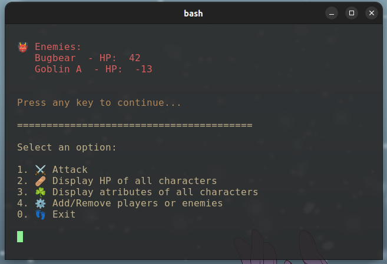

# Combat RPG

A cli tool to make the life of the Game Master easier. It is a simple tool to help the Game Master to manage the combat of a RPG game. And also doesn't limit the Game Master to use the tool only for combat, it can be used for any kind of interaction with the players. So, for an example, if the player wants to kill himself, he can do this using this tool. 

The main purpose of this program is to make the calculations more automatic and to make the game more dynamic.



See [demos](https://github.com/ThiaudioTT/combatRPG/tree/master/demo) for more images.

## How to use

You can open the `src/main.py` or open a terminal inside the project folder and run:

```bash
python3 ./src/main.py
```

```bash
python ./src/main.py
```

## Requirements

You will need to have a terminal that renders emoji and stuff.

- Python 3
- A terminal that renders emoji and supports colors

### Linux

You can use the default terminal. Kitty is also a good option.

### On windows

Install [Windows Terminal](https://www.microsoft.com/store/productId/9N0DX20HK701) and [Python](https://apps.microsoft.com/detail/9p7qfqmjrfp7)


